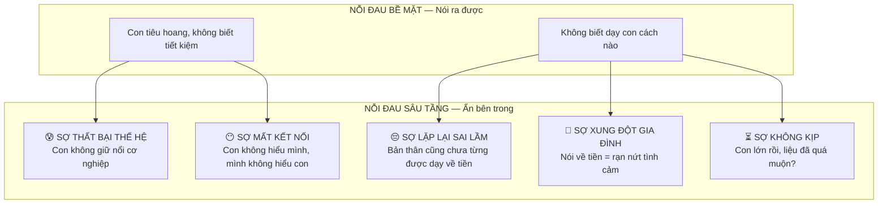
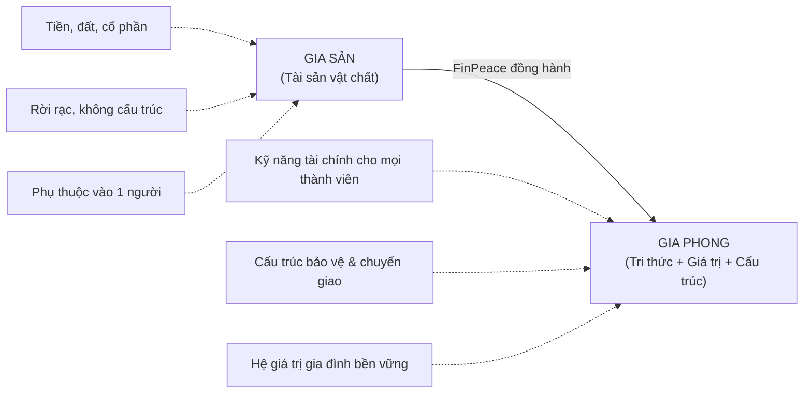
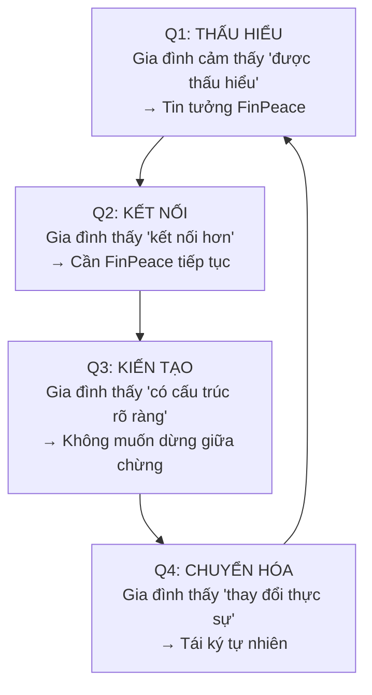

# FINPEACE — CHIẾN LƯỢC CHƯƠNG TRÌNH ĐỒNG HÀNH TÀI CHÍNH GIA ĐÌNH
## *"Từ Gia Sản đến Gia Phong"* — Family Wealth Mentoring Program

> **Đối tượng:** Gia đình trung lưu cao / HNW / Elite tại TP lớn — Bố mẹ thế hệ 7x–đầu 8x, con cái Gen Z/Alpha — Nhóm 4–5 thành viên  
> **Mục tiêu tài liệu:** Bản phân tích Customer Insight & Định hướng Chiến lược chương trình đồng hành cả năm  
> **Thương hiệu:** FinPeace

---

# PHẦN I — THẤU HIỂU KHÁCH HÀNG (Customer Insight)

## 1. Chân dung gia đình mục tiêu

### 1.1. Bố mẹ — Thế hệ "Xây dựng từ hai bàn tay trắng"

Họ sinh ra trong thập niên 70–đầu 80, lớn lên trong giai đoạn hậu bao cấp và Đổi Mới. Họ đã chứng kiến — và trực tiếp tham gia — một trong những cuộc chuyển hóa kinh tế ngoạn mục nhất châu Á. Họ là thế hệ đã đi lên từ thiếu thốn, đã chấp nhận hy sinh, và giờ đang ở **đỉnh cao tích lũy** của đời mình.

**Bức tranh tâm lý:**

```
┌─────────────────────────────────────────────────────────────┐
│                    THẾ HỆ 7x – ĐẦU 8x                      │
│                                                             │
│   ✦ Đã "chiến thắng" trong cuộc đua tích lũy              │
│   ✦ Đang ở đỉnh sự nghiệp (CEO, chủ DN, chuyên gia)      │
│   ✦ Bắt đầu nghĩ về "chương cuối" — để lại gì?            │
│                                                             │
│   NHƯNG:                                                    │
│   ⚠ Cảm giác cô đơn trong quyết định tài chính lớn        │
│   ⚠ Thiếu người tin cậy để bàn chuyện tiền bạc gia đình   │
│   ⚠ Sợ rằng "cho con tất cả" lại chính là "hại con"       │
│   ⚠ Chưa bao giờ được ai dạy cách "chuyển giao"           │
└─────────────────────────────────────────────────────────────┘
```

**5 đặc trưng cốt lõi:**

| # | Đặc trưng | Biểu hiện thực tế |
|---|-----------|-------------------|
| 1 | **Tự lực cánh sinh** | Phần lớn tài sản do chính họ tạo ra, không thừa kế. Tin vào kỷ luật, lao động và tiết kiệm. Có xu hướng đánh giá thấp giá trị của con cái nếu con "chưa trải đời". |
| 2 | **Áp lực "Thế hệ Sandwich"** | Vừa chăm sóc cha mẹ già (theo truyền thống hiếu đạo), vừa lo cho con cái — nhưng ít khi nghĩ đến quỹ hưu trí cho chính mình. |
| 3 | **Tài sản tập trung, thiếu cấu trúc** | 70–80% tài sản nằm ở bất động sản hoặc cổ phần doanh nghiệp gia đình — thanh khoản thấp, không có cấu trúc pháp lý bảo vệ, chưa lập di chúc. |
| 4 | **Giỏi kiếm tiền, ngại nói về tiền** | Thành công trong kinh doanh nhưng gặp khó trong việc trò chuyện cởi mở về tiền bạc với vợ/chồng và con cái. Coi đó là chuyện "người lớn". |
| 5 | **Khao khát nhưng không biết bắt đầu từ đâu** | 95% đồng ý rằng cần dạy con về tài chính, nhưng phần lớn cảm thấy thiếu phương pháp, thiếu công cụ, và thiếu người đồng hành đáng tin cậy. |

### 1.2. Con cái — Thế hệ "Sinh ra trong đủ đầy"

Con cái của họ (thường 8–22 tuổi) là **digital natives** — lớn lên với MoMo, ZaloPay, Shopee, TikTok Shopping. Mối quan hệ của các con với tiền bạc hoàn toàn khác cha mẹ:

| Cha mẹ (7x/8x) | Con cái (Gen Z / Alpha) |
|:---|:---|
| Tiền = Sức lao động cụ thể, được trả bằng mồ hôi | Tiền = Số trên màn hình, "tap" một cái là xong |
| Tiết kiệm = Đức tính quan trọng nhất | Trải nghiệm = Giá trị sống ưu tiên |
| Tài sản = Vàng, đất, sổ tiết kiệm | Tài sản = Crypto, cổ phiếu, thương hiệu cá nhân |
| Mua sắm = Cân nhắc kỹ, so sánh giá | Mua sắm = FOMO, bị ảnh hưởng bởi KOL |
| Nói về tiền = Nhạy cảm, riêng tư | Nói về tiền = Sẵn sàng, thậm chí trên mạng xã hội |

> [!IMPORTANT]
> **Insight then chốt:** Vấn đề không nằm ở chỗ thế hệ nào "đúng" hay "sai". Vấn đề nằm ở chỗ **hai thế hệ đang nói hai ngôn ngữ tài chính hoàn toàn khác nhau** — và trong gia đình, không ai đóng vai "người phiên dịch". FinPeace cần là người phiên dịch đó.

---

## 2. Bản đồ nỗi đau (Pain Map)

### 2.1. Nỗi đau bề mặt — Những gì khách hàng nói ra

Đây là những lo lắng mà bố mẹ sẽ thốt ra trong cuộc trò chuyện đầu tiên:

> *"Con tôi tiêu tiền như nước, không biết quý đồng tiền."*
>
> *"Tôi muốn dạy con về tài chính nhưng không biết bắt đầu từ đâu."*
>
> *"Con tôi giỏi về học thuật nhưng không có khái niệm gì về quản lý tiền."*
>
> *"Tôi sợ nếu cho con nhiều tiền, con sẽ hư."*

### 2.2. Nỗi đau sâu tầng — Những gì thực sự ám ảnh họ

Dưới lớp lo lắng bề mặt là một hệ thống **5 nỗi sợ nền tảng** mà cha mẹ HNW Việt Nam thế hệ 7x–8x hiếm khi nói thẳng ra, nhưng chi phối mọi quyết định tài chính gia đình:



#### Nỗi sợ #1: "Không ai giàu ba họ" — Sợ thất bại thế hệ

* **Dữ liệu thực tế:** 70% gia đình mất tài sản ở thế hệ thứ hai, 90% ở thế hệ thứ ba. Tại Việt Nam, ước tính 98% gia tộc chưa có chiến lược chuyển giao bài bản.
* **Tâm lý cha mẹ:** *"Tôi mất 30 năm gầy dựng. Con tôi có thể mất 3 năm để phá sản."*
* **Nghịch lý:** Càng thành công, nỗi sợ này càng lớn. Càng nhiều tài sản, gánh nặng "truyền lại cho ai, truyền lại như thế nào" càng đè nặng.

#### Nỗi sợ #2: Đứt gãy thế hệ — "Con không hiểu tôi, tôi không hiểu con"

* **Biểu hiện:** Bố mẹ kể về quá khứ gian khổ → con thấy xa lạ, giáo điều. Con chia sẻ về crypto, NFT → bố mẹ thấy viển vông, thiếu thực tế. Khoảng cách trải nghiệm ~20 năm tạo ra một **bức tường vô hình** trong giao tiếp tài chính gia đình.
* **Hệ quả:** Cuộc trò chuyện về tiền bạc trở thành bài giảng một chiều hoặc bị tránh hoàn toàn.

#### Nỗi sợ #3: "Chính tôi cũng chưa được dạy" — Sợ lặp lại sai lầm

* **Sự thật ít ai thừa nhận:** Thế hệ 7x–8x, dù thành công về tài chính, cũng **tự mày mò** hoàn toàn. Họ học từ sai lầm đắt giá, từ khủng hoảng, từ thị trường. Không ai ngồi xuống dạy họ cách quản lý gia sản.
* **Hệ quả:** Họ biết cách kiếm tiền nhưng không tự tin rằng mình có thể **dạy** con kiếm tiền. Họ muốn có một khuôn khổ rõ ràng, một phương pháp bài bản — nhưng không biết tìm ở đâu.

#### Nỗi sợ #4: "Nói về tiền = Nói về chia" — Sợ xung đột nội bộ

* **Rào cản văn hóa Á Đông:** Tại Việt Nam, thảo luận về di chúc, phân chia tài sản, hoặc thậm chí nói thẳng về tình hình tài chính gia đình thường bị coi là "điều cấm kỵ" — vì sợ gây rạn nứt hoặc bị xem là "chưa chết đã chia."
* **Dữ liệu:** ~70% gia đình Việt không lập di chúc vì tâm lý ngại va chạm. Kết quả: tranh chấp thừa kế tại tòa án đang tăng mạnh trong những năm gần đây.

#### Nỗi sợ #5: "Con lớn rồi, liệu còn kịp không?" — Sợ bỏ lỡ thời điểm vàng

* **Sự thật khoa học:** Trẻ em hình thành thói quen và niềm tin cốt lõi về tiền bạc (money script) trước 7 tuổi. Nhiều bậc cha mẹ đến với FinPeace khi con đã 15–18 tuổi và cảm thấy "đã muộn".
* **Cơ hội cho FinPeace:** Chương trình cần **xóa bỏ mặc cảm "quá muộn"** và cho phụ huynh thấy rằng giai đoạn con 12–22 tuổi thực ra là thời điểm cực kỳ chiến lược — con đã đủ nhận thức để hiểu các khái niệm phức tạp, nhưng chưa rời khỏi "quỹ đạo gia đình" hoàn toàn.

---

## 3. Nhu cầu thực sự (Jobs To Be Done)

Khi một gia đình HNW tìm đến FinPeace, họ không chỉ muốn "dạy con về tiền." Họ đang thuê FinPeace làm 4 công việc cùng lúc:

| # | Job To Be Done | Câu nói đại diện |
|---|:---|:---|
| **J1** | **Phiên dịch viên thế hệ** — Giúp bố mẹ và con cái nói cùng ngôn ngữ tài chính | *"Tôi muốn nói chuyện tiền bạc với con mà không biến thành bài giảng đạo đức."* |
| **J2** | **Kiến trúc sư gia sản** — Thiết kế cấu trúc bảo vệ và chuyển giao tài sản an toàn | *"Tôi muốn biết chắc rằng tài sản của mình được bảo vệ khi tôi không còn."* |
| **J3** | **Huấn luyện viên tài chính cho con** — Trang bị kỹ năng thực chiến cho thế hệ kế cận | *"Tôi muốn con tôi tự đứng trên đôi chân mình, nhưng không phải học từ sai lầm như tôi."* |
| **J4** | **Người giữ hòa khí** — Tạo không gian an toàn để gia đình thảo luận về tiền | *"Tôi muốn cả nhà cùng bàn chuyện tài chính mà không ai bị tổn thương."* |

> [!TIP]
> **Nguyên tắc bán hàng cốt lõi:** Không bán "khóa học tài chính." Bán **sự yên tâm** rằng *gia đình mình sẽ ổn — dù 10 năm, 20 năm, hay 30 năm nữa.*

---

# PHẦN II — KHUNG CHIẾN LƯỢC CHƯƠNG TRÌNH ĐỒNG HÀNH

## 4. Triết lý nền tảng: "Từ Gia Sản đến Gia Phong"

Chương trình của FinPeace không phải là một khóa học kiến thức. Đây là một **hành trình chuyển hóa** — chuyển hóa gia đình từ nhóm cá nhân sở hữu tài sản chung thành một đơn vị quản trị gia sản có chiến lược, có giá trị, có kết nối.



### Sự khác biệt giữa hai lớp giáo dục mà FinPeace tích hợp

Điều làm nên sự khác biệt của FinPeace so với các khóa học tài chính cá nhân thông thường là việc **tích hợp đồng thời hai tầng giáo dục** — và cả hai đều không thể thiếu:

| Chiều so sánh | Giáo dục Tài chính Cá nhân <br>*(thị trường đang cung cấp)* | Giáo dục Tài chính Gia đình <br>*(FinPeace bổ sung)* |
|:---|:---|:---|
| **Câu hỏi trọng tâm** | *"Làm sao TÔI quản lý tiền hiệu quả?"* | *"Làm sao GIA ĐÌNH MÌNH cùng thịnh vượng qua nhiều thế hệ?"* |
| **Sản phẩm đầu ra** | Kỹ năng kỹ thuật: lãi kép, đầu tư, quản lý nợ, bảo hiểm | Hệ giá trị chung: thói quen, thái độ, quy tắc ứng xử về tiền trong gia đình |
| **Cách học** | Lý trí, cá nhân, qua sách/khóa học | Thẩm thấu, tập thể, qua hành vi hằng ngày và đối thoại mở |
| **Ai là "giáo viên"?** | Chuyên gia tài chính | **Cha mẹ** — được FinPeace trang bị khuôn khổ để trở thành "money mentor" đầu tiên |
| **Yếu tố cảm xúc** | Trung lập — tập trung vào con số | Rất cao — gắn liền với tình yêu, kỳ vọng, nỗi sợ, và ước mơ gia đình |
| **Tầm nhìn thời gian** | 1–5 năm (mục tiêu cá nhân) | 20–50 năm (di sản liên thế hệ) |
| **Thước đo thành công** | Thu nhập tăng, tài sản tích lũy | Gia đình hòa thuận, con tự chủ, gia sản bền vững |

> [!NOTE]
> **Thông điệp chiến lược:** *"Thị trường dạy con bạn cách kiếm tiền. FinPeace giúp gia đình bạn cùng giữ tiền — và giữ nhau."*

---

## 5. Cấu trúc Chương trình Đồng hành Cả năm

### 5.1. Tổng quan — 4 Giai đoạn

Chương trình được thiết kế theo chu kỳ 12 tháng, chia thành 4 giai đoạn — mỗi giai đoạn xây dựng trên nền tảng của giai đoạn trước:

```mermaid
gantt
    title Hành trình 12 tháng cùng FinPeace
    dateFormat  Q
    axisFormat %q

    section "Q1: THẤU HIỂU"
    Khám phá DNA Tài chính Gia đình       :q1, Q1, 90d

    section "Q2: KẾT NỐI"
    Xây dựng Ngôn ngữ Tài chính Chung     :q2, after q1, 90d

    section "Q3: KIẾN TẠO"
    Thiết kế Kiến trúc Gia sản            :q3, after q2, 90d

    section "Q4: CHUYỂN HÓA"
    Tổng kết & Lộ trình Liên thế hệ      :q4, after q3, 90d
```

---

### 5.2. Chi tiết từng Giai đoạn

#### 🔍 Q1 — THẤU HIỂU: "Gia đình mình đang ở đâu?"
**Mục tiêu:** Thiết lập niềm tin, hiểu rõ "DNA tài chính" riêng biệt của từng gia đình.

| Hoạt động | Nội dung | Đầu ra |
|:---|:---|:---|
| **Session 1: Family Financial Health Check** | Đánh giá toàn diện sức khỏe tài chính gia đình: tài sản, nợ, dòng tiền, bảo hiểm, quỹ dự phòng, kế hoạch hưu trí. | Báo cáo "Bức tranh tài chính gia đình" — lần đầu tiên tất cả thành viên nhìn vào cùng một bản đồ. |
| **Session 2: Money Script Discovery** | Workshop nhóm: mỗi thành viên chia sẻ "kỷ niệm đầu tiên với tiền bạc", niềm tin gốc về tiền, và cách tiền ảnh hưởng đến cảm xúc. | Phát hiện các "money script" (niềm tin vô thức về tiền) đang vận hành trong gia đình — ví dụ: *"Tiền bạc không mua được hạnh phúc"* hay *"Phải tiết kiệm mọi lúc"*. |
| **Session 3: Generational Dialogue** | Phiên đối thoại có hướng dẫn giữa bố mẹ và con cái: Bố mẹ kể hành trình tài chính thực sự (gồm cả sai lầm). Con chia sẻ mong muốn và nỗi lo thực sự. | Phá vỡ "bức tường im lặng" về tiền bạc. Lần đầu tiên hai thế hệ lắng nghe nhau thay vì giảng cho nhau. |

> [!TIP]
> **Khoảnh khắc "Aha" kỳ vọng:** Bố mẹ nhận ra con cái không hề "vô tâm" — con chỉ đang thiếu ngữ cảnh. Con nhận ra bố mẹ không hề "cổ hủ" — bố mẹ chỉ đang thiếu ngôn ngữ.

---

#### 🤝 Q2 — KẾT NỐI: "Cả nhà nói cùng ngôn ngữ tài chính"
**Mục tiêu:** Xây dựng kỹ năng tài chính thực chiến cho cả gia đình, tạo thói quen đối thoại đều đặn.

| Hoạt động | Cho Bố mẹ | Cho Con cái | Cùng nhau |
|:---|:---|:---|:---|
| **Monthly Family Finance Meeting** | Học cách chủ trì cuộc họp tài chính gia đình định kỳ (không phải "bài giảng" mà là "buổi brainstorm") | Được trao vai trò: Thư ký tài chính, Quản lý một quỹ nhỏ | Cùng review chi tiêu tháng, đặt mục tiêu tiết kiệm chung |
| **Hệ thống 6 Hũ Gia đình** (JARS nâng cấp) | Áp dụng phân bổ thu nhập theo 6 mục đích | Mỗi con nhận ngân sách cá nhân, tự chia theo 6 hũ | So sánh cách phân bổ của bố mẹ và con → thảo luận sự khác biệt |
| **"Needs vs. Wants" Challenge** | — | 30 ngày ghi chép chi tiêu, phân loại Cần vs. Muốn | Cuối tháng: cả nhà review — không phán xét, chỉ tò mò |
| **Real-World Money Lab** | Giao một dự án tài chính thực tế cho con (quản lý ngân sách du lịch gia đình, mua sắm dịp Tết...) | Lên kế hoạch, thực thi, báo cáo kết quả | Bố mẹ đóng vai "nhà đầu tư" — đánh giá dựa trên quy trình, không chỉ kết quả |

---

#### 🏗️ Q3 — KIẾN TẠO: "Thiết kế kiến trúc gia sản"
**Mục tiêu:** Từ tri thức → hành động. Bắt đầu xây dựng cấu trúc bảo vệ và chuyển giao tài sản.

| Hoạt động | Nội dung | Đầu ra |
|:---|:---|:---|
| **Masterclass: Kiến trúc Gia sản** | Workshop chuyên sâu: Family Holding, Trust, Di chúc, Bảo hiểm nhân thọ như công cụ chuyển giao — được giải thích bằng ngôn ngữ gia đình, không phải ngôn ngữ luật sư. | Gia đình hiểu rõ các lựa chọn cấu trúc pháp lý phù hợp với tình huống cụ thể. |
| **Family Constitution Workshop** | Cùng nhau soạn thảo "Hiến chương Gia đình" — bộ quy tắc về: cách chia sẻ thông tin tài chính, quy trình quyết định đầu tư, nguyên tắc ứng xử khi có xung đột tài chính. | Bản nháp Hiến chương Gia đình — văn bản "sống" được cập nhật hàng năm. |
| **Succession Simulation** | Bài tập mô phỏng: "Nếu bố/mẹ bất ngờ không thể quản lý tài sản, điều gì sẽ xảy ra? Ai làm gì? Ai cần biết gì?" | Lộ trình kế thừa sơ bộ — phát hiện các lỗ hổng cần khắc phục. |
| **Investment Apprenticeship** | Con cái (đặc biệt >16 tuổi) được giao quản lý một danh mục đầu tư "vệ tinh" thực tế với vốn nhỏ, có sự giám sát và hướng dẫn. | Báo cáo đầu tư hàng tháng — con học cách ra quyết định, chịu trách nhiệm, và trình bày lý do đầu tư. |

---

#### 🌟 Q4 — CHUYỂN HÓA: "Gia phong của chúng ta là gì?"
**Mục tiêu:** Tổng kết, đo lường chuyển biến, và thiết lập nền tảng cho hành trình dài hạn.

| Hoạt động | Nội dung | Đầu ra |
|:---|:---|:---|
| **Family Legacy Statement** | Cả gia đình cùng viết "Tuyên ngôn Di sản": Gia đình mình tin vào điều gì? Gia đình mình muốn để lại gì cho thế giới? | Tuyên ngôn 1 trang — được in đóng khung hoặc số hóa — là "kim chỉ nam" cho mọi quyết định tài chính tương lai. |
| **Annual Financial Report Card** | So sánh "Bức tranh tài chính" đầu năm và cuối năm. Đo lường: kiến thức tăng, hành vi thay đổi, mức độ kết nối gia đình, tiến bộ trong cấu trúc bảo vệ tài sản. | Báo cáo chuyển biến có dữ liệu — giúp gia đình nhìn thấy rõ giá trị của hành trình. |
| **Roadmap Năm 2** | Thiết kế lộ trình đồng hành năm tiếp theo: nâng cấp cấu trúc gia sản, mở rộng danh mục đầu tư, hoặc chuẩn bị cho cột mốc mới (con vào đại học, con khởi nghiệp, kế hoạch hưu trí). | Bản đề xuất tái ký hợp đồng — tự nhiên, không cần "push sales", vì gia đình đã thấy giá trị thực. |

---

## 6. Lý do khách hàng ký hợp đồng cả năm — Mô hình "Flywheel" niềm tin

Việc ký hợp đồng cả năm không phải là quyết định một lần. Nó là kết quả của một vòng lặp niềm tin được xây dựng dần qua từng giai đoạn:



> [!IMPORTANT]
> **Nguyên tắc vàng:** Mỗi session phải tạo ra ít nhất **một khoảnh khắc "Aha"** cho bố mẹ VÀ **một khoảnh khắc "Wow, bố/mẹ hiểu mình"** cho con cái. Đó là loại giá trị khiến khách hàng không bao giờ muốn rời đi.

---

## 7. Yếu tố khác biệt cạnh tranh (Competitive Moat)

| Đối thủ / Giải pháp hiện tại | Họ làm gì | FinPeace làm khác |
|:---|:---|:---|
| Khóa học tài chính cá nhân (online/offline) | Dạy kiến thức cho **cá nhân** | Dạy **cả gia đình** cùng lúc — biến bàn ăn thành lớp học tài chính |
| Ngân hàng / Công ty chứng khoán (Wealth Management) | Quản lý **danh mục đầu tư** | Quản lý **mối quan hệ gia đình với tiền** — sâu hơn con số |
| Luật sư / Kế toán | Soạn di chúc, cấu trúc thuế | Chuẩn bị **con người** trước khi cấu trúc **pháp lý** |
| Sách / YouTube / Podcast tài chính | Cung cấp thông tin đại chúng | Cung cấp **đồng hành cá nhân hóa** cho từng gia đình |

**Moat (lợi thế cạnh tranh bền vững) của FinPeace:**
1. **Đồng hành cả gia đình, không chỉ cá nhân** — duy nhất trên thị trường Việt Nam.
2. **Kết hợp tâm lý + kỹ năng + cấu trúc** — không chỉ dạy kiến thức mà chạm vào cảm xúc và thay đổi hành vi.
3. **Tích hợp hai tầng giáo dục** — cá nhân (technical skills) + gia đình (values & habits) trong cùng một chương trình.
4. **Cam kết dài hạn (12 tháng)** — đủ thời gian để tạo ra thay đổi thực sự, không phải "bán khóa học xong bỏ chạy."

---

## 8. Thông điệp Marketing cốt lõi

### Tagline chính:
> ### *"Không phải bạn cần dạy con về tiền. Bạn cần cả gia đình cùng học về tiền — cùng nhau."*

### Messaging theo từng nỗi đau:

| Nỗi đau | Thông điệp FinPeace |
|:---|:---|
| *"Con tôi tiêu hoang quá"* | *"Con bạn không thiếu ý thức. Con bạn thiếu một hệ thống — và một người đồng hành."* |
| *"Tôi sợ con không giữ nổi gia sản"* | *"Gia sản không tự bảo vệ mình. Nhưng một gia đình có 'gia phong' thì có thể."* |
| *"Tôi không biết bắt đầu từ đâu"* | *"Bạn không cần biết tất cả. Bạn chỉ cần bắt đầu từ một cuộc trò chuyện thật — cùng cả nhà."* |
| *"Liệu có quá muộn không?"* | *"12–22 tuổi: con đã đủ hiểu để thay đổi, nhưng vẫn đủ gần để lắng nghe. Đây đúng là lúc."* |
| *"Nói về tiền sợ chia rẽ"* | *"Gia đình chia rẽ không phải vì nói về tiền. Gia đình chia rẽ vì không bao giờ nói về tiền."* |

---

## 9. Chỉ số đo lường thành công (KPIs)

### Cho gia đình (báo cáo cuối năm):

| Chỉ số | Cách đo | Mục tiêu |
|:---|:---|:---|
| Financial Literacy Score | Bài kiểm tra kiến thức đầu năm vs. cuối năm (cả bố mẹ và con) | Tăng ≥40% |
| Family Financial Communication Index | Khảo sát: tần suất & chất lượng các cuộc trò chuyện về tiền trong gia đình | Từ "hiếm khi/căng thẳng" → "đều đặn/thoải mái" |
| Structural Protection Score | Checklist: Di chúc? Bảo hiểm? Quỹ dự phòng? Hiến chương gia đình? | Hoàn thành ≥70% checklist |
| Next-Gen Readiness Index | Đánh giá: con có đang tự quản lý một ngân sách? Có hiểu cấu trúc tài sản gia đình? | Tất cả con ≥14 tuổi đạt "Sẵn sàng Cơ bản" |

### Cho FinPeace (chỉ số kinh doanh):

| Chỉ số | Mục tiêu Năm 1 |
|:---|:---|
| Tỷ lệ tái ký hợp đồng Năm 2 | ≥ 75% |
| NPS (Net Promoter Score) | ≥ 70 |
| Referral Rate (giới thiệu gia đình mới) | ≥ 30% khách hàng giới thiệu ít nhất 1 gia đình |

---

> [!CAUTION]
> **Lưu ý quan trọng về phạm vi:** FinPeace đóng vai trò **Coach/Mentor** — trang bị khuôn khổ tư duy, kỹ năng và chiến lược cho gia đình. FinPeace **KHÔNG** thay thế vai trò của luật sư (soạn di chúc, cấu trúc Trust), kế toán (tối ưu thuế), hay quản lý quỹ (ra quyết định đầu tư). Khi gia đình cần các dịch vụ chuyên sâu này, FinPeace đóng vai trò **kết nối và điều phối** với mạng lưới chuyên gia đối tác — đảm bảo lợi ích tốt nhất cho gia đình.

---

*Tài liệu chiến lược nội bộ — FinPeace Family Wealth Mentoring Program — Phiên bản 1.0*
